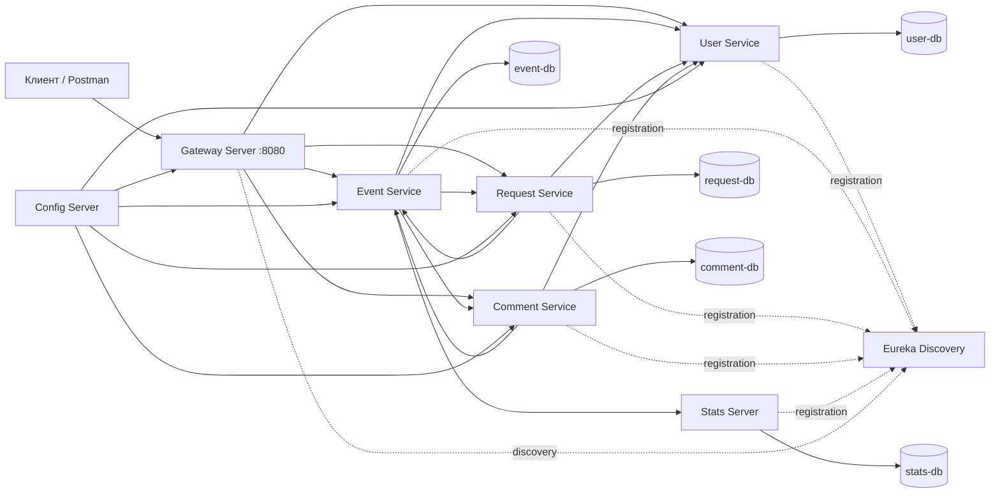

# Explore With Me Plus

Микросервисное приложение для публикации событий, поиска мероприятий, подачи заявок на участие и работы с комментариями.

Все внешние HTTP-запросы проходят через API Gateway на порту `8080`. Доменные данные разделены между независимыми сервисами и отдельными базами PostgreSQL.

## Технологии

- Java 21
- Spring Boot 3.3.0
- Spring Cloud 2023.0.3
- Spring Cloud Gateway
- Netflix Eureka
- Spring Cloud Config
- OpenFeign
- Resilience4j Circuit Breaker
- PostgreSQL 16.1
- QueryDSL
- Maven
- Docker Compose

## Архитектура




## Структура Maven-проекта

```text
java-explore-with-me-plus
├── core
│   ├── interaction-api
│   ├── user-service
│   ├── event-service
│   ├── request-service
│   └── comment-service
├── infra
│   ├── discovery-server
│   ├── config-server
│   └── gateway-server
├── stats-service
│   ├── stats-dto
│   ├── stats-client
│   └── stats-server
├── postman
├── docker-compose.yml
└── pom.xml
```

Монолитный `main-service` удалён. Его функциональность распределена между доменными микросервисами.

## Сервисы

| Сервис | Назначение | Локальный порт |
|---|---|---:|
| `gateway-server` | Единая точка входа во внешний API | `8080` |
| `discovery-server` | Eureka Service Registry | `8761` |
| `config-server` | Централизованная конфигурация | `8888` внутри Docker-сети |
| `user-service` | Пользователи и административные операции с пользователями | `8085` |
| `event-service` | События, категории и подборки | `8084` |
| `request-service` | Заявки на участие в событиях | `8082` |
| `comment-service` | Комментарии и их модерация | `8083` |
| `stats-server` | Сбор и получение статистики просмотров | `9090` |

Внешним клиентам следует использовать только Gateway:

```text
http://localhost:8080
```

Прямые порты доменных сервисов предназначены для локальной диагностики и внутренних проверок.

## Владение данными

Каждый доменный сервис владеет своей базой данных и не обращается напрямую к таблицам другого сервиса.

| База | Владелец | Таблицы |
|---|---|---|
| `user-db` | `user-service` | `users` |
| `event-db` | `event-service` | `events`, `categories`, `compilations` и таблицы связей |
| `request-db` | `request-service` | `requests` |
| `comment-db` | `comment-service` | `comments` |
| `stats-db` | `stats-server` | статистика обращений к эндпоинтам |

Между базами нет внешних ключей. Связи между доменами хранятся как идентификаторы:

- `event.initiatorId`;
- `request.eventId`;
- `request.requesterId`;
- `comment.eventId`;
- `comment.authorId`;
- `comment.moderatorId`.

Данные, необходимые для формирования ответа без дополнительного сетевого вызова, могут сохраняться как снимок. Например, событие хранит имя инициатора вместе с его идентификатором.

## Маршруты Gateway

Конфигурация маршрутов находится в:

```text
infra/config-server/src/main/resources/config/gateway-server/application.yml
```

| Маршрут | Сервис |
|---|---|
| `/admin/users`, `/admin/users/**` | `user-service` |
| `/events`, `/events/**` | `event-service` |
| `/categories`, `/categories/**` | `event-service` |
| `/compilations`, `/compilations/**` | `event-service` |
| `/admin/events`, `/admin/events/**` | `event-service` |
| `/admin/categories`, `/admin/categories/**` | `event-service` |
| `/admin/compilations`, `/admin/compilations/**` | `event-service` |
| `/users/*/events`, `/users/*/events/**` | `event-service` |
| `/users/*/requests`, `/users/*/requests/**` | `request-service` |
| `/users/*/events/*/requests`, `/users/*/events/*/requests/**` | `request-service` |
| `/admin/comments`, `/admin/comments/**` | `comment-service` |
| `/users/*/comments`, `/users/*/comments/**` | `comment-service` |
| `/events/*/comments`, `/events/*/comments/**` | `comment-service` |
| `/comments/**` | `comment-service` |

Маршрута `Path=/**` нет. Неизвестный путь возвращает `404`, а не перенаправляется в удалённый монолит.

## Внутреннее взаимодействие

Сервисы находят друг друга через Eureka и вызывают внутренние API с помощью OpenFeign.

### `user-service`

```http
GET /internal/users/{userId}
```

Возвращает основные данные пользователя для других сервисов.

### `event-service`

```http
GET /internal/events/{eventId}
```

Возвращает данные события, необходимые сервисам заявок и комментариев.

### `request-service`

```http
POST /internal/requests/confirmed-counts
Content-Type: application/json
```

Принимает список идентификаторов событий и возвращает количество подтверждённых заявок для каждого события.

### `comment-service`

```http
POST /internal/comments/approved-counts
Content-Type: application/json
```

Принимает список идентификаторов событий и возвращает количество одобренных комментариев для каждого события.

Внутренние DTO и контракты находятся в модуле:

```text
core/interaction-api
```

## Защита от N+1

При формировании коллекции событий `event-service` не выполняет отдельный сетевой запрос для каждого события.

Для списка идентификаторов событий выполняется:

1. один пакетный запрос в `request-service`;
2. один пакетный запрос в `comment-service`;
3. объединение полученных карт со списком событий.

Поэтому количество межсервисных запросов не растёт линейно вместе с числом событий.

## Отказоустойчивость

Для исходящих OpenFeign-вызовов используются:

- таймаут подключения — `1000 ms`;
- таймаут чтения — `2000 ms`;
- до трёх попыток для сетевых ошибок и ответов `5xx`;
- Resilience4j Circuit Breaker;
- fallback-фабрики с доступом к исходной причине ошибки.

Ответы `4xx` не считаются отказом сервиса и не должны открывать Circuit Breaker.

### Критические зависимости

Если операция требует проверки пользователя или события, а соответствующий сервис недоступен, возвращается контролируемый ответ:

```text
503 Service Unavailable
```

Примеры:

- создание события при недоступном `user-service`;
- создание заявки при недоступном `user-service` или `event-service`;
- создание комментария при недоступном `user-service` или `event-service`.

Отсутствующий пользователь или событие возвращают:

```text
404 Not Found
```

### Некритические зависимости

Счётчики в DTO события считаются дополнительной информацией.

При недоступном `request-service`:

```json
{
  "confirmedRequests": 0
}
```

При недоступном `comment-service`:

```json
{
  "commentsCount": 0
}
```

Основная информация о событии продолжает возвращаться с HTTP `200`.

Ошибка отправки статистического hit не должна блокировать основной сценарий получения события.

## Дополнительная функциональность: комментарии

### Возможности

- создание комментариев к опубликованным событиям;
- редактирование и удаление собственного комментария;
- административная модерация;
- хранение идентификатора модератора;
- получение опубликованных комментариев;
- поле `commentsCount` в DTO событий;
- пакетная загрузка количества комментариев;
- постраничная пагинация комментариев.

### Статусы комментария

- `PENDING` — ожидает модерации;
- `APPROVED` — опубликован;
- `REJECTED` — отклонён;
- `DELETED` — удалён пользователем или администратором.

Новый комментарий получает статус `PENDING`. В публичном API доступны только комментарии со статусом `APPROVED`.

### Интеграция с событиями

В `EventFullDto` и `EventShortDto` добавлено поле:

```json
{
  "commentsCount": 0
}
```

Количество одобренных комментариев подгружается одним пакетным запросом для всей коллекции событий.

## API комментариев

### Публичные эндпоинты

#### Получение опубликованных комментариев события

```http
GET /events/{eventId}/comments?from=0&size=10
```

Параметры:

- `eventId` — идентификатор события;
- `from` — номер страницы, по умолчанию `0`;
- `size` — размер страницы, по умолчанию `10`.

Возвращаются только комментарии со статусом `APPROVED`.

#### Получение опубликованного комментария

```http
GET /comments/{commentId}
```

Комментарий должен иметь статус `APPROVED`. Для неопубликованного, отклонённого или удалённого комментария возвращается `404 Not Found`.

### Приватные эндпоинты

#### Создание комментария

```http
POST /users/{userId}/comments/events/{eventId}
Content-Type: application/json
```

Тело запроса:

```json
{
  "text": "Текст комментария"
}
```

Условия:

- пользователь существует;
- событие существует и опубликовано;
- новый комментарий получает статус `PENDING`.

#### Обновление своего комментария

```http
PATCH /users/{userId}/comments/{commentId}
Content-Type: application/json
```

Пользователь должен быть автором комментария.

Правила:

- текст разрешено изменять только у комментария `PENDING`;
- пользователь может изменить статус только на `DELETED`;
- перевод в `DELETED` разрешён независимо от текущего статуса.

#### Удаление своего комментария

```http
DELETE /users/{userId}/comments/{commentId}
```

Физического удаления строки не происходит. Комментарий переводится в статус `DELETED`.

### Административные эндпоинты

#### Получение комментариев для модерации

```http
GET /admin/comments?from=0&size=10
```

Возвращаются комментарии со статусом `PENDING`.

#### Модерация комментария

```http
PATCH /admin/comments/{userId}/{commentId}
Content-Type: application/json
```

`userId` — идентификатор модератора.

Администратор может:

- изменить текст;
- установить статус `APPROVED`;
- установить статус `REJECTED`;
- установить статус `DELETED`.

Идентификатор модератора сохраняется в комментарии.

#### Удаление комментария администратором

```http
DELETE /admin/comments/{userId}/{commentId}
```

Комментарий переводится в статус `DELETED`, а `userId` сохраняется как идентификатор модератора.

## Централизованная конфигурация

Конфигурации сервисов находятся в:

```text
infra/config-server/src/main/resources/config
```

Основные каталоги:

```text
config
├── comment-service
├── event-service
├── gateway-server
├── request-service
├── stats-server
└── user-service
```

Локальные `application.yml` доменных сервисов содержат только имя приложения, настройки Eureka и импорт Config Server.

## Запуск проекта

### Требования

- JDK 21;
- Maven 3.9+;
- Docker Desktop или Docker Engine с Docker Compose.

### Сборка

Из корня проекта:

```bash
mvn clean package
```

Ожидаемый результат:

```text
BUILD SUCCESS
```

### Запуск Docker Compose

```bash
docker compose up -d --build
```

Проверка контейнеров:

```bash
docker compose ps -a
```

Для работающей конфигурации должны быть запущены 13 контейнеров:

- пять PostgreSQL;
- Eureka;
- Config Server;
- Gateway;
- четыре доменных сервиса;
- Stats Server.

### Остановка

Без удаления данных:

```bash
docker compose down
```

С удалением всех баз и чистым следующим запуском:

```bash
docker compose down -v
```

Команда с `-v` необратимо удаляет Docker volumes с локальными данными.

## Полезные адреса

| Назначение | URL |
|---|---|
| Внешний API | `http://localhost:8080` |
| Eureka Dashboard | `http://localhost:8761` |
| User Service Health | `http://localhost:8085/actuator/health` |
| Request Service Health | `http://localhost:8082/actuator/health` |
| Comment Service Health | `http://localhost:8083/actuator/health` |
| Event Service Health | `http://localhost:8084/actuator/health` |
| Stats Server Health | `http://localhost:9090/actuator/health` |

## Проверка API

Основные Postman-коллекции находятся в:

```text
postman/
```

Коллекции сервиса статистики:

```text
stats-service/stats-server/postman/
```

Все запросы основного API следует запускать через:

```text
http://localhost:8080
```

Перед полным тестовым прогоном с чистым состоянием:

```bash
docker compose down -v
docker compose up -d --build
```

## Финальная проверка

```bash
mvn clean package
docker compose config --quiet
docker compose up -d --build
docker compose ps -a
```

Дополнительно рекомендуется последовательно останавливать доменные сервисы и проверять:

- фиксированные значения некритичных счётчиков;
- `503` для критических зависимостей;
- сохранение работоспособности Gateway;
- `404` для неизвестных маршрутов;
- отсутствие обращений к удалённому `main-service`.
