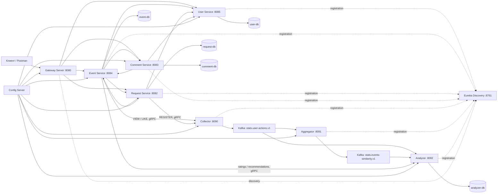

# Explore With Me Plus

Микросервисное приложение для публикации событий, поиска мероприятий, подачи заявок на участие, работы с комментариями и формирования персональных рекомендаций.

Все внешние HTTP-запросы проходят через API Gateway:

```text
http://localhost:8080
```

Доменные данные разделены между независимыми сервисами и отдельными базами PostgreSQL. Пользовательские действия передаются через gRPC в Collector, публикуются в Kafka и обрабатываются сервисами Aggregator и Analyzer.

## Технологии

- Java 21
- Spring Boot 3.3.0
- Spring Cloud 2023.0.3
- Spring Cloud Gateway
- Netflix Eureka
- Spring Cloud Config
- OpenFeign
- Resilience4j Circuit Breaker
- gRPC
- Apache Kafka 3.8.1
- Apache Avro
- PostgreSQL 16.1
- QueryDSL
- Maven
- Docker Compose

## Архитектура



## Структура Maven-проекта

```text
java-explore-with-me-plus
├── core
│   ├── interaction-api
│   ├── user-service
│   ├── event-service
│   ├── request-service
│   └── comment-service
├── infra
│   ├── discovery-server
│   ├── config-server
│   └── gateway-server
├── stats-service
│   ├── stats-proto
│   ├── stats-client
│   ├── stats-avro
│   ├── collector
│   ├── aggregator
│   └── analyzer
├── postman
├── docker-compose.yml
└── pom.xml
```

Монолитный `main-service` и прежний REST-сервис статистики удалены. Основная функциональность распределена между доменными микросервисами, а статистика и рекомендации реализованы отдельным событийным контуром.

## Сервисы

| Сервис | Назначение | Локальный порт |
|---|---|---:|
| `gateway-server` | Единая точка входа во внешний HTTP API | `8080` |
| `discovery-server` | Eureka Service Registry | `8761` |
| `config-server` | Централизованная конфигурация | `8888` внутри Docker-сети |
| `user-service` | Пользователи и административные операции | `8085` |
| `event-service` | События, категории, подборки, рейтинги и рекомендации | `8084` |
| `request-service` | Заявки на участие | `8082` |
| `comment-service` | Комментарии и модерация | `8083` |
| `collector` | Приём пользовательских действий по gRPC | `8090` |
| `aggregator` | Расчёт сходства событий по данным Kafka | `8091` |
| `analyzer` | Хранение действий, рейтинги и рекомендации по gRPC | `8092` |
| `kafka` | Передача действий и коэффициентов сходства | `9092` |

Прямые порты сервисов предназначены для локальной диагностики. Внешние запросы основного API следует направлять через Gateway.

## Владение данными

Каждый доменный сервис владеет своей базой данных и не обращается напрямую к таблицам другого сервиса.

| База | Владелец | Данные |
|---|---|---|
| `user-db` | `user-service` | пользователи |
| `event-db` | `event-service` | события, категории, подборки |
| `request-db` | `request-service` | заявки на участие |
| `comment-db` | `comment-service` | комментарии и модерация |
| `analyzer-db` | `analyzer` | пользовательские действия и сходство событий |

Между базами нет внешних ключей. Межсервисные связи хранятся как идентификаторы.

## Маршруты Gateway

Конфигурация маршрутов:

```text
infra/config-server/src/main/resources/config/gateway-server/application.yml
```

| Маршрут | Сервис |
|---|---|
| `/admin/users`, `/admin/users/**` | `user-service` |
| `/events`, `/events/**` | `event-service` |
| `/categories`, `/categories/**` | `event-service` |
| `/compilations`, `/compilations/**` | `event-service` |
| `/admin/events`, `/admin/events/**` | `event-service` |
| `/admin/categories`, `/admin/categories/**` | `event-service` |
| `/admin/compilations`, `/admin/compilations/**` | `event-service` |
| `/users/*/events`, `/users/*/events/**` | `event-service` |
| `/users/*/requests`, `/users/*/requests/**` | `request-service` |
| `/users/*/events/*/requests`, `/users/*/events/*/requests/**` | `request-service` |
| `/admin/comments`, `/admin/comments/**` | `comment-service` |
| `/users/*/comments`, `/users/*/comments/**` | `comment-service` |
| `/events/*/comments`, `/events/*/comments/**` | `comment-service` |
| `/comments/**` | `comment-service` |

Маршрута `Path=/**` нет. Неизвестный путь возвращает `404`. Внутренние эндпоинты `/internal/**` через Gateway не публикуются.

## Внутреннее взаимодействие

Доменные сервисы находят друг друга через Eureka и вызывают внутренние HTTP API с помощью OpenFeign.

```http
GET  /internal/users/{userId}
GET  /internal/events/{eventId}
POST /internal/requests/confirmed-counts
POST /internal/comments/approved-counts
```

Общие внутренние DTO и контракты находятся в модуле:

```text
core/interaction-api
```

## Защита от N+1

При формировании коллекции событий выполняются пакетные запросы:

1. один запрос в `request-service`;
2. один запрос в `comment-service`;
3. один запрос рейтингов в Analyzer;
4. объединение данных со списком событий.

Количество межсервисных запросов не растёт линейно вместе с количеством событий.

## Рекомендательная система

### Пользовательские действия

| Действие | Вес |
|---|---:|
| `VIEW` | `0.4` |
| `REGISTER` | `0.8` |
| `LIKE` | `1.0` |

Для пары «пользователь — событие» сохраняется максимальный вес совершённого действия. Повторное действие с тем же или меньшим весом не увеличивает рейтинг.

Рейтинг события равен сумме актуальных весов всех пользователей для этого события.

### VIEW

Действие отправляется только после успешного публичного запроса:

```http
GET /events/{eventId}
X-EWM-USER-ID: {userId}
```

Заголовок необязателен для получения события. Без него действие не отправляется. Получение списка событий не создаёт `VIEW`.

### REGISTER

Действие `REGISTER` отправляет `request-service` после успешного создания заявки на участие.

### LIKE

```http
PUT /events/{eventId}/like
X-EWM-USER-ID: {userId}
```

Условия:

- идентификатор пользователя положительный;
- событие существует и имеет статус `PUBLISHED`;
- у пользователя есть подтверждённая заявка;
- повторный LIKE идемпотентен.

Если подтверждённой заявки нет или `request-service` недоступен, возвращается `409 Conflict`, а действие не попадает в Analyzer.

### Рекомендации

```http
GET /events/recommendations
X-EWM-USER-ID: {userId}
```

Эндпоинт возвращает до десяти опубликованных событий в порядке Analyzer. События, с которыми пользователь уже взаимодействовал, исключаются.

В полные и краткие DTO событий добавлено поле `rating`. Публичный поиск поддерживает сортировку по рейтингу. Устаревшая сортировка `VIEWS` не используется.

### Kafka-топики

```text
stats.user-actions.v1
stats.events-similarity.v1
```

- Collector публикует действия;
- Aggregator рассчитывает сходство событий;
- Analyzer читает оба топика, хранит состояние и отвечает на gRPC-запросы `event-service`.

## Отказоустойчивость

Для OpenFeign-вызовов используются таймауты, повторные попытки, Circuit Breaker и fallback-фабрики.

При недоступном Analyzer:

- событие возвращается с HTTP `200`;
- `rating` принимает значение `0.0`;
- рекомендации возвращаются как `[]`.

При недоступном Collector:

- основной HTTP-запрос продолжает выполняться;
- действие не записывается;
- `event-service` и `request-service` сохраняют health-статус `UP`.

Для необязательных gRPC-каналов отключено влияние `grpcChannel` на общий Actuator health.

## Комментарии

Поддерживаются:

- создание комментариев к опубликованным событиям;
- редактирование и удаление собственного комментария;
- административная модерация;
- статусы `PENDING`, `APPROVED`, `REJECTED`, `DELETED`;
- поле `commentsCount` в DTO событий;
- пакетная загрузка количества одобренных комментариев;
- пагинация.

### Публичные эндпоинты

```http
GET /events/{eventId}/comments?from=0&size=10
GET /comments/{commentId}
```

Возвращаются только комментарии со статусом `APPROVED`.

### Приватные эндпоинты

```http
POST   /users/{userId}/comments/events/{eventId}
PATCH  /users/{userId}/comments/{commentId}
DELETE /users/{userId}/comments/{commentId}
```

### Административные эндпоинты

```http
GET    /admin/comments?from=0&size=10
PATCH  /admin/comments/{userId}/{commentId}
DELETE /admin/comments/{userId}/{commentId}
```

Физического удаления комментариев не происходит: статус меняется на `DELETED`.

## Централизованная конфигурация

```text
infra/config-server/src/main/resources/config
```

```text
config
├── aggregator
├── analyzer
├── collector
├── comment-service
├── event-service
├── gateway-server
├── request-service
└── user-service
```

## Запуск проекта

### Требования

- JDK 21
- Maven 3.9+
- Docker Desktop или Docker Engine с Docker Compose

### Полная сборка и тесты

```bash
mvn clean verify
```

Ожидаемый результат:

```text
BUILD SUCCESS
```

### Запуск

```bash
docker compose up -d --build
docker compose config --quiet
docker compose ps -a
```

Compose создаёт 17 контейнеров:

- пять PostgreSQL;
- Eureka;
- Config Server;
- Gateway;
- четыре доменных сервиса;
- Kafka;
- одноразовый `kafka-init`;
- Collector;
- Aggregator;
- Analyzer.

`kafka-init` создаёт топики и завершается со статусом `Exited (0)`. Остальные сервисы должны быть запущены, а контейнеры с healthcheck — иметь статус `healthy`.

### Остановка

Без удаления данных:

```bash
docker compose down
```

С удалением всех локальных данных:

```bash
docker compose down -v
```

Команда с `-v` необратимо удаляет Docker volumes.

## Полезные адреса

| Назначение | URL |
|---|---|
| Внешний API | `http://localhost:8080` |
| Eureka Dashboard | `http://localhost:8761` |
| Request Service Health | `http://localhost:8082/actuator/health` |
| Comment Service Health | `http://localhost:8083/actuator/health` |
| Event Service Health | `http://localhost:8084/actuator/health` |
| User Service Health | `http://localhost:8085/actuator/health` |
| Collector | `localhost:8090` |
| Aggregator Health | `http://localhost:8091/actuator/health` |
| Analyzer Health | `http://localhost:8092/actuator/health` |
| Kafka | `localhost:9092` |

## Проверка Kafka-топиков

```bash
docker exec kafka /opt/kafka/bin/kafka-topics.sh \
  --bootstrap-server localhost:29092 \
  --list
```

Ожидаются:

```text
stats.user-actions.v1
stats.events-similarity.v1
```

## Проверка API

Postman-коллекции находятся в:

```text
postman/
```

Запросы основного API выполняются через `http://localhost:8080`. Внутренние маршруты `/internal/**` через Gateway не публикуются.

## Финальная проверка

```bash
mvn clean verify
docker compose config --quiet
docker compose up -d --build
docker compose ps -a
```

Дополнительно проверяются:

- регистрация сервисов в Eureka;
- наличие двух Kafka-топиков;
- `404` для `/internal/**` через Gateway;
- VIEW только для одиночного успешного получения события с `X-EWM-USER-ID`;
- REGISTER после создания заявки;
- LIKE только при подтверждённой заявке;
- рекомендации без уже просмотренных или оценённых событий;
- `rating = 0.0` и `[]` при недоступном Analyzer;
- сохранение HTTP-доступности при недоступном Collector.
